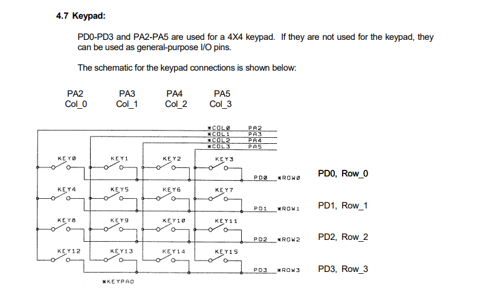
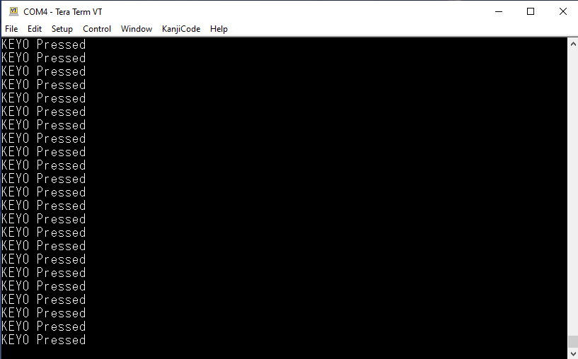

# ECE 425 - Microprocessor Systems
**CSU Northridge**

**Department of Electrical and Computer Engineering**

## EduBase Keypad
Refer to the following functions in the GPIO.c source file:
- `EduBase_Keypad_Init`
- `Get_EduBase_Keypad_Status`

As shown in the image below, the keypad on the EduBase board uses the `PA2 - PA5` pins for the columns and `PD0 - PD3` for the rows.

## Tera Term Output

The EduBase Keypad driver uses the UART0 module to display which key on the keypad is being pressed using the Tera Term terminal. After flashing the program to the TM4C123G LaunchPad, connect to the COM port used by the TM4C123G LaunchPad with 115200 baud rate.

An example Tera Term output is shown in the image below.

